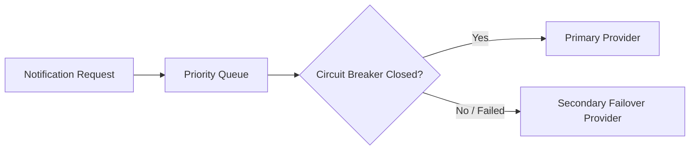

# F3: Circuit Breaker & Provider Failover

## Technical Specification
Automated upstream provider failover protecting against third-party outages.

```mermaid
flowchart LR
    Request[Notification Request] --> Priority[Priority Queue]
    Priority --> Breaker{Circuit Breaker Closed?}
    Breaker -->|Yes| Primary[Primary Provider]
    Breaker -->|No / Failed| Secondary[Secondary Failover Provider]
```
