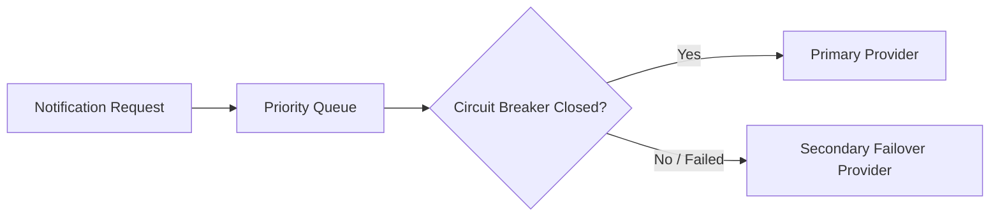

# F4: Exponential Backoff & Dead-Letter Queue

## Technical Specification
Resilient retry mechanics with DLQ redrive capabilities.

```mermaid
flowchart LR
    Request[Notification Request] --> Priority[Priority Queue]
    Priority --> Breaker{Circuit Breaker Closed?}
    Breaker -->|Yes| Primary[Primary Provider]
    Breaker -->|No / Failed| Secondary[Secondary Failover Provider]
```
