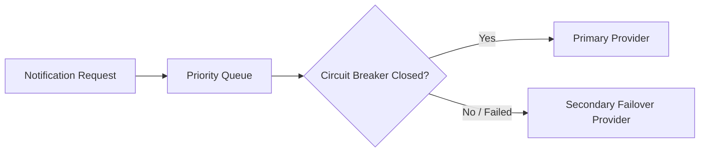

# F5: User Preferences & Quiet Hours Engine

## Technical Specification
Timezone-aware quiet hours suppression and recipient opt-out enforcement.

```mermaid
flowchart LR
    Request[Notification Request] --> Priority[Priority Queue]
    Priority --> Breaker{Circuit Breaker Closed?}
    Breaker -->|Yes| Primary[Primary Provider]
    Breaker -->|No / Failed| Secondary[Secondary Failover Provider]
```
